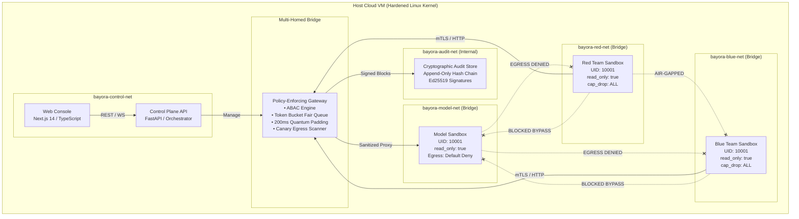

# Bayora Architecture Specification

## 1. System Overview
Bayora is an AI safety validation platform designed to continuously evaluate frontier LLMs against adversarial attacks under rigorous tenant isolation guarantees. The architecture establishes a zero-trust multi-tenant cloud environment where three distinct entities execute simultaneously:

1. **Red Team Adversarial Agent**: Generates and submits adversarial prompts, jailbreak patterns, and instruction override sequences.
2. **Blue Team Defensive Engine**: Deploys defensive guardrails, semantic classifiers, and output sanitizers.
3. **Model Under Test**: The evaluated language model running in a clean sandbox with strictly partitioned inference contexts.

All three run concurrently within a shared environment, strictly isolated to prevent early payload leakage, defense rule inference, cross-session memory contamination, or environmental side-channels.

---

## 2. Container & Sandbox Isolation Topology



---

## 3. Cryptographic Sealed-Commit Protocol

To guarantee the **Zero Early Redaction Leakage Invariant**, Bayora uses a commit-reveal scheme:

```mermaid
sequenceDiagram
    autonumber
    actor Red as Red Team
    participant GW as Policy Gateway
    participant Blue as Blue Defense
    participant Model as Model Sandbox
    participant Audit as Hash Chain Ledger

    Note over Red,Audit: Phase 1: Test Initiation & Payload Commitment
    Red->>Red: Generate payload P and hex nonce N
    Red->>Red: Compute H = SHA256(P || "::" || N)
    Red->>GW: Submit H (Commitment Hash) + Metadata
    GW->>Audit: Append PAYLOAD_COMMITTED(H) (Ed25519 signed)

    Note over GW,Model: Phase 2: Isolated Execution & Timing Defense
    GW->>Blue: Execute defensive classifiers inside Gateway hook
    Note over Blue: Blue observes encrypted/hooked buffer; raw payload redacted from UI/logs
    Blue-->>GW: Defense verdict (Triggered / Pass)
    GW->>Model: Forward sanitized inference with injected Canary string
    Model-->>GW: Raw model completion
    GW->>GW: Scan egress for canary leaks
    GW->>GW: Compute elapsed t; delay until quantum bucket (e.g., 200ms + jitter)
    GW-->>Red: Return bucket-padded execution receipt

    Note over Red,Audit: Phase 3: Run Conclusion & Cryptographic Reveal
    Red->>GW: Reveal (P, N)
    GW->>GW: Verify SHA256(P || "::" || N) == H
    alt Match Verified
        GW->>Audit: Append PAYLOAD_REVEALED(Verified=True)
        GW->>Audit: Generate Merkle Checkpoint
        GW-->>Red: Status VERIFIED_MATCH
        Note over Blue: Blue team can now view revealed payload for post-mortem
    else Tamper / Mismatch
        GW->>Audit: Append ANOMALY(Commitment Mismatch)
        GW-->>Red: Status TAMPER_DETECTED (Critical Alert)
    end
```

---

## 4. Constant-Time Quantum Padding Algorithm
To prevent the Red team from measuring defensive filter depth via millisecond latency variations, the Gateway implements quantum bucket delay normalization:

$$\text{Bucket} = \left\lceil \frac{t_{\text{actual}}}{T_{\text{quantum}}} \right\rceil \times T_{\text{quantum}}$$
$$\text{Delay} = (\text{Bucket} + \text{Jitter}) - t_{\text{actual}}$$

Where:
- $T_{\text{quantum}} = 200\text{ ms}$ (configurable quantum bucket size)
- $\text{Jitter} \in [2.0\text{ ms}, 25.0\text{ ms}]$ (random uniform entropy)
- If actual execution takes 15ms or 160ms, observable latency is padded to ~205-215ms.

---

## 5. Append-Only Hash Chain & Merkle Tree Derivation
Every audit event block $i$ is linked to block $i-1$:

$$\text{Block Hash}_i = \text{SHA-256}(i \parallel \text{Timestamp} \parallel \text{EventType} \parallel \text{Tenant} \parallel \text{PayloadHash} \parallel \text{MetaJSON} \parallel \text{PrevHash})$$
$$\text{Signature}_i = \text{Ed25519}_{\text{priv}}(\text{Block Hash}_i)$$

Periodic Merkle trees are constructed over block batches, yielding a single 32-byte Merkle root signed with the platform's root key. Independent auditors verify runs using zero-trust proofs without relying on database integrity.
